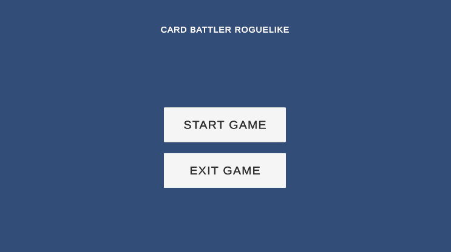
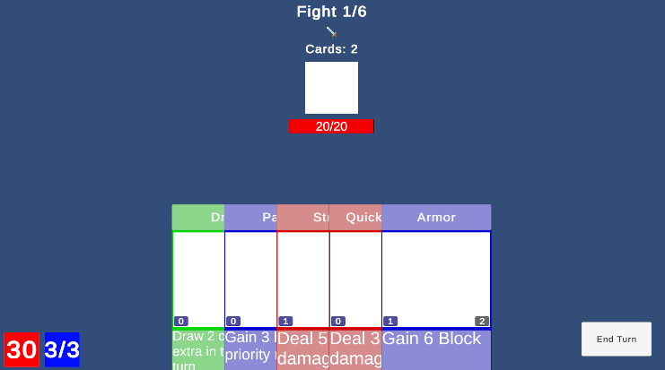

# Card Battler Roguelike

A 2D turn-based card battler roguelike built in Unity.

## Overview
Fight through 5 increasingly difficult encounters before facing the final boss. Build your deck by choosing rewards after each victory. Master the priority system to outplay your enemies.

## Gameplay Features
- **6 Fights Total**: 5 normal encounters + 1 boss fight
- **Deck Building**: Choose card or stat upgrades after each victory
- **Priority-Based Combat**: Cards resolve by priority (lower number = faster)
- **20 Unique Cards**: Attack, defense, utility, and advanced cards
- **Boss Mechanics**: Phase shift at 50% HP (increased speed)

## Combat Mechanics
- **Mana System**: Start with 3 mana, refills each turn
- **Block System**: Absorbs damage before HP
- **Simultaneous Resolution**: Player and enemy cards resolve together by priority
- **Card Effects**: Damage, block, draw, heal, buffs, conditional effects

## Controls
- **Mouse Click**: Play cards from hand
- **End Turn Button**: Execute turn and resolve all cards
- **Hover**: View card details

## Enemy Types
- **Aggressive**: Attack-focused, minimal defense
- **Defensive**: Balanced approach, defends when low HP
- **Boss**: Large deck, phase shift mechanic, high HP

## Tech Stack
- Unity 2D
- C# with ScriptableObject architecture
- Strategy pattern for card effects
- Singleton pattern for managers

## Development
- **Solo Developer**: Self-taught indie dev
- **Purpose**: Portfolio project #2

## How to Play
1. Launch game from Main Menu
2. Play cards by clicking (costs mana)
3. Click "End Turn" to resolve
4. Choose rewards after victory
5. Defeat the boss to win!

## Known Limitations
- Placeholder art/sprites
- Basic UI (functional, not polished)
- Balance tuned for winnable experience (not competitive)

## Screenshots

---

**Built with Unity 2D as a learning project in game development.**

